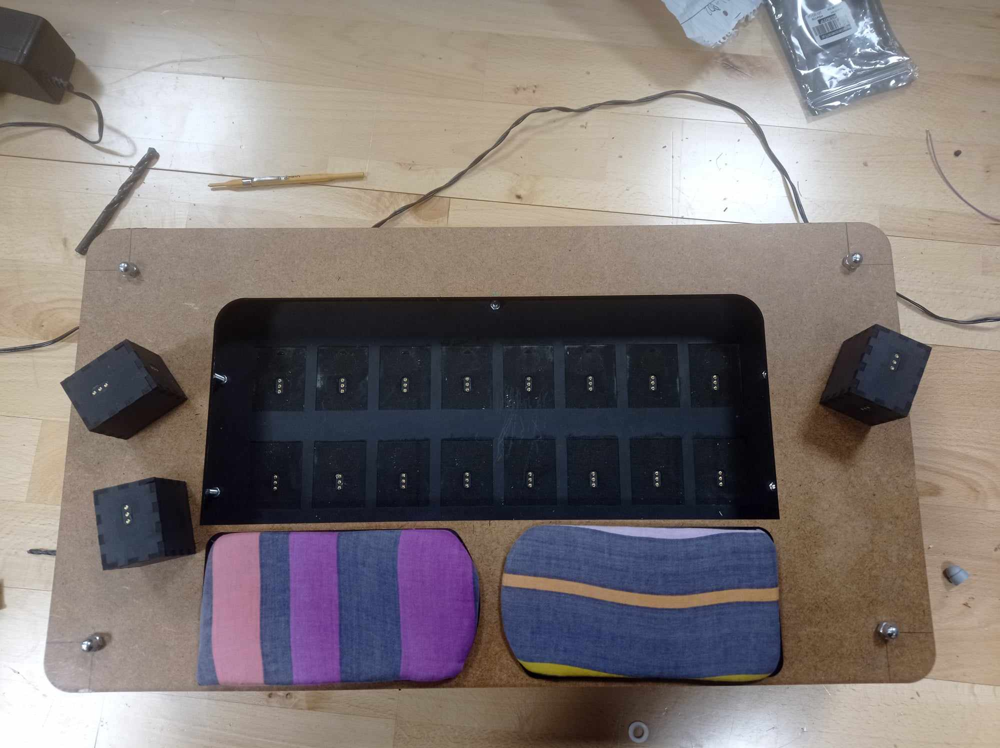

The project involves the development of a simple sequencer designed as a musical toy for children with cochlear implants. 
The primary concept is for the user to place objects, such as cubes, onto specific steps, thereby activating those steps. Each side of the cube will be assigned a different pitch. 
By activating steps/pitches the user can feel the haptic feedback from the boards. This project utilizes the BELA IO board and Pure Data for implementation. You can ream more about it in the report.

